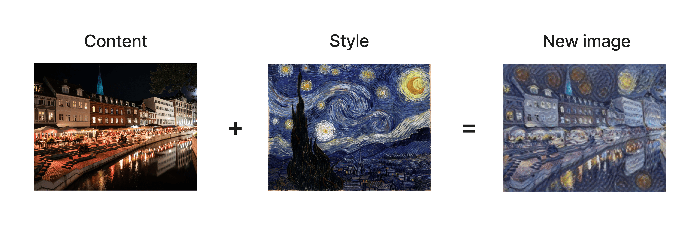

 
<h1 align="center">Style Transfer Playground</h1> 

## Live demo
In the making

## Run locally 
It is recommended you create a virtual environment for installing the dependencies in this repository.

1. Clone this repository `git clone https://github.com/jankounchained/style-transfer-playground.git`
2. Create a virtual environment `cd style-transfer-playground && python3 -m venv ENV_NAME`
3. Install requirements `pip install -r requirements.txt` if on Linux, or `pip install -r requirements_macos.txt` if you're on MacOS
4. Run the app with `streamlit run Intro.py`
